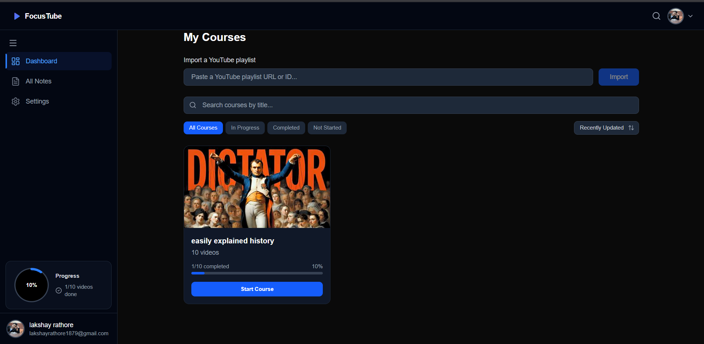

# FocusTube 🎓

A distraction-free YouTube study platform. Paste a playlist URL → get a structured course → watch videos inside the app → take rich text notes → generate AI study notes with summaries and quizzes.



Deployed on [Vercel](https://focus-tube-eight.vercel.app/) 

## Features

- **Playlist Import** — Paste any YouTube playlist URL; the app extracts metadata and all videos via YouTube Data API v3
- **In-App Video Player** — Modal YouTube embed with autoplay, mark-complete, and note-taking controls
- **Progress Tracking** — Per-video status (not_started / in_progress / completed) with visual progress rings and course-level progress bar
- **Rich Text Notes** — Tiptap editor with autosave (1.5s debounce), one note per video
- **AI Study Notes** — Click "Generate" per video to produce a structured summary (hook sentence + key points) and a multi-question quiz with clickable answer options
- **Dashboard** — Course cards with progress bars, Continue Watching section, search filter, playlist import form
- **All Notes Page** — Browse all notes grouped by course, search by content, open in modal editor
- **Sidebar Stats** — Real-time progress ring showing completion rate, updates instantly when videos are marked complete
- **Course Deletion** — Delete entire courses with confirmation modal (cascading delete of videos + notes)
- **Google OAuth** — Sign in with Google via NextAuth v5, JWT sessions

## Stack

| Layer | Technology |
|---|---|
| **Framework** | Next.js 16 (Turbopack, App Router, TypeScript) |
| **Styling** | Tailwind CSS v4 (CSS-native config) |
| **Database** | PostgreSQL on Neon (free tier) via Prisma 7 |
| **Auth** | NextAuth / Auth.js v5 — Google OAuth, JWT sessions |
| **AI** | Google Gemini API (`gemini-3.1-flash-lite`) |
| **Rich Text** | Tiptap (StarterKit, Underline, Placeholder) |
| **Icons** | Lucide React |
| **Deploy** | Vercel Hobby |

## Getting Started

### 1. Clone and install

```bash
git clone https://github.com/LakshayRathore18/FocusTube.git
cd FocusTube
npm install
```

### 2. Set up environment variables

```bash
cp .env.example .env.local
```

Fill in all values in `.env.local` — see below for where to get each one.

### 3. Push database schema

```bash
npx prisma db push
npx prisma generate
```

### 4. Run dev server

```bash
npm run dev
```

Open [http://localhost:3000](http://localhost:3000) and sign in with Google.

## Environment Variables

| Variable | Where to get it |
|---|---|
| `DATABASE_URL` | Neon dashboard → your project → connection string |
| `NEXTAUTH_URL` | `http://localhost:3000` (dev) |
| `NEXTAUTH_SECRET` | Run `openssl rand -base64 32` |
| `GOOGLE_CLIENT_ID` | Google Cloud Console → APIs & Services → Credentials |
| `GOOGLE_CLIENT_SECRET` | Same as above |
| `YOUTUBE_API_KEY` | Google Cloud Console → YouTube Data API v3 |
| `GEMINI_API_KEY` | [aistudio.google.com](https://aistudio.google.com) |
| `SUPADATA_API_KEY` | [supadata.ai](https://supadata.ai) |


## Key Scripts

| Command | Purpose |
|---|---|
| `npm run dev` | Start Next.js dev server on `localhost:3000` |
| `npm run build` | Production build |
| `npm run lint` | ESLint check |
| `npm run cleanup:ai` | One-off cleanup of stale AI content rows (after schema changes) |
| `npx prisma db push` | Sync schema with Neon PostgreSQL |
| `npx prisma generate` | Regenerate Prisma client types |
| `npx prisma studio` | Browse database in browser |
| `npx tsc --noEmit` | TypeScript type-check |

## Project Structure

See [`AGENTS.md`](./AGENTS.md) for the AI agent context map and architecture overview.
See [`structure.md`](./structure.md) for the full file-by-file breakdown with in-depth visual flow charts.
See [`todo.md`](./todo.md) for build progress and design decisions.

## Architecture Highlights

**AI Content — shared generation, per-user unlock:**
AI content is generated once per video globally (keyed by `youtubeVideoId`) to save API costs. Per-user access is tracked via `Video.aiContentUnlockedAt` timestamp. The first request wins the generation race via a database unique constraint (P2002 lock).

**Concurrency-safe generation:**
When two users request AI notes for the same video simultaneously, only one INSERT succeeds — the other catches the unique violation and polls for the result (2s intervals, max 15 attempts).

**Components refactored:**
`CourseContent.tsx` was split into 6 focused files: `types.ts`, `StatusBadge.tsx`, `NotesModal.tsx`, `VideoPlayerModal.tsx`, `AIContentModal.tsx`, and the main orchestrator.

**Real-time sidebar stats:**
When a video status changes, a custom `refresh-stats` DOM event is dispatched, triggering the sidebar to re-fetch and update the progress ring instantly — no page refresh needed.

**Production Ready:**
The project has completed a production readiness audit and is ready for deployment on Vercel Hobby. All critical issues have been addressed, including React hooks fixes, proper Next.js Link usage, and correct ESLint compliance.
